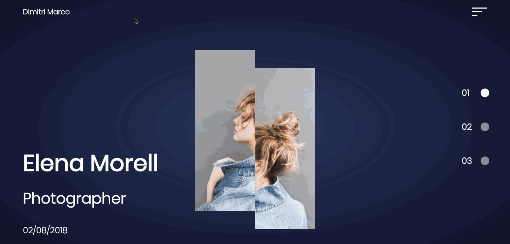

# Portfolio Website
## Live Demo
 __https://jytang10.github.io/portfolio-website/__

<hr/>
Responsive portfolio website built using HTML, CSS and JavaScript

## Getting Started
1. Fork and clone from this repository onto your local machine
```
$ git clone https://github.com/[user_name]/portfolio-website.git
```
2. Open the ```index.html``` file located in the new folder
3. Website is ready to be viewed.

## Built With
* [JavaScript](https://www.ecma-international.org/publications/standards/Ecma-262.htm)
* HTML5
* CSS3

## Contributing
Please feel free to fork from this repository, make pull requests and help improve the website by sending suggestions to dev.jamestang.gmail.com

## License
This project is licensed under the MIT License - see the below for details.
[MIT License](https://opensource.org/licenses/mit-license.php)

[](https://opensource.org/licenses/mit-license.php)